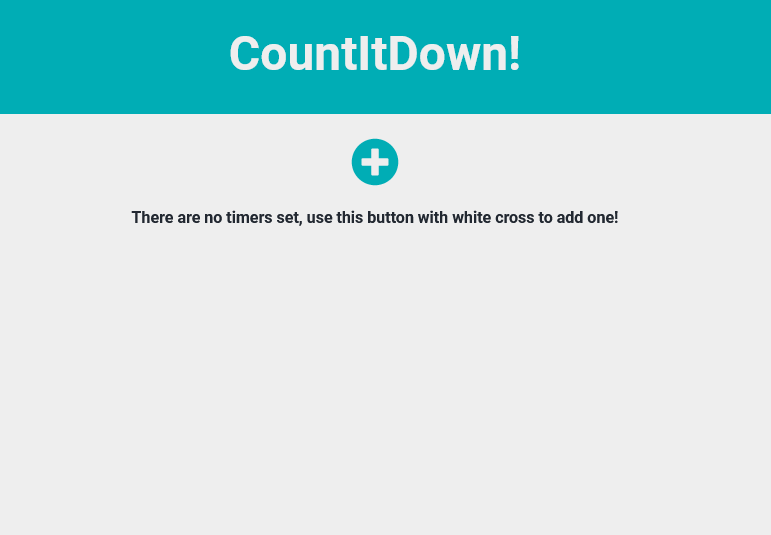

# countItDown!
## Live version: [Live](https://michalosik.github.io/countdowner/)
## Table of contents

* [Description](#description)

* [How to use](#how-to-use) 

* [Installation](#installation)

## Description


**CountItDown!** is my first app, that I made alone with use of VueJS. It's simple application that is able to count the time between two dates. You can add as many counters as you want. App saves timers in localstorage of web browser. Try it!


## How to use

### Adding new Timer

After installation and launch on server, you should add new counter using the add button (white cross in green circle).




Next, you have to fill the form and add new timer!


### Removing Timer

If you want to remove timer, you can do it by clicking trash icon in right corner of timer.


## Installation

### Project setup

```
npm install
```

### Compiles and hot-reloads for development

```
npm run serve
```

### Compiles and minifies for production

```
npm run build
```

### Lints and fixes files

```
npm run lint
```


